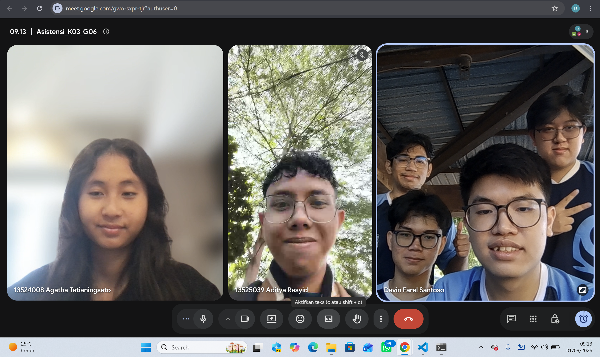

# Form Asistensi

## Tugas Besar IF2150 - Rekayasa Perangkat Lunak

| Informasi | Keterangan |
| --- | --- |
| **Hari** | Selasa |
| **Tanggal** | 1 September 2026 |
| **Kelas** | K-03 |
| **Nomor Kelompok** | 6  |
| **Nama Kelompok** | Shifu  |
| **Nama Perangkat Lunak** | Ngerja-In |
| **Dokumen** | K03_G06_Template1_TB.md  |

### Anggota Kelompok

| NIM | Nama |
| --- | --- |
| 13525033 | Davin Farel Santoso |
| 13525039 | Aditya Rasyid|
| 13525102 | Karmel Tua Haloho |
| 13525096 | Muhammad Ridwan Nasir Firdaus |
| 13525123 | Sebastio Nugroho |

### Catatan

| Catatan |
| --- |
| 1. Tidak memerlukan administrator dan payment gateaway sebagai aktor, karena tidak berhubungan langsung dengan pennguna platform. |
| 2. Deskripsi mengenai kegiatan yang dapat dilakukan aktor pada Bab 3 lebih dispesifikkan. |
| 3. Beberapa poin pada Bab 3.3 bisa digabungkan jika mengandung kegiatan yang serupa.  |
| 4. Aktivitas pada Bab 3.3 bisa dihapus jika dilakukan oleh developer software. |
| 5. Pada Bab 3.4 bisa difokuskan pada kegiatan spesifik yang dilakukan oleh pengguna utama, seperti tenaga kerja dan penyedia pekerjaan kepada sistem platform. |

## Dokumentasi

<!--  -->

  

  <i>Gambar 1. Dokumentasi kegiatan asistensi.</i>

