<h1>
IF2150 REKAYASA PERANGKAT LUNAK
 
TUGAS 3
 
USE CASE & SCENARIO USE CASE
</h1>
 

## *Nama Perangkat Lunak*: Kerja-In

### Untuk: Agatha Tatianingseto

Dipersiapkan oleh:

| Informasi | Keterangan |
| --- | --- |
| Kelas | 03 |
| Kelompok | Shifu  |

| NIM | Nama |
| --- | --- |
| 13525033 | Davin Farel Santoso |
| 13525039 | Aditya Rasyid|
| 13525096 | Muhammad Ridwan Nasir Firdaus |
| 13525102 | Karmel Tua Haloho |
| 13525123 | Sebastio Nugroho |

---

## Daftar Perubahan

| Revisi | Deskripsi |
| :--- | :--- |
| *A* | *Deskripsikan perubahan yang dilakukan dari dokumen sebelumnya pada dokumen ini. Jika tidak terdapat perubahan, harap kosongkan tabel.* |
| *B* |  |
| *C* |  |
| ... |  |

 
 

# BAB 1: Deskripsi Perangkat Lunak
Perangkat lunak yang diusulkan adalah sebuah platform marketplace jasa berbasis web yang mempertemukan pencari jasa (Penyedia Kerja) dengan pekerja sektor informal (Tenaga Kerja) secara langsung. Dari sudut pandang pengguna, Penyedia Kerja dapat dengan mudah mencari, memilih, dan mempekerjakan bantuan harian, seperti tukang kebersihan, kuli angkat, atau asisten perbaikan ringan dengan berdasarkan lokasi, harga, dan ulasan. Sebaliknya, Tenaga kerja dapat membuat profil, menerima tawaran pekerjaan di sekitar mereka, dan membangun reputasi/portofolio dari setiap pekerjaan yang diselesaikan.
Target platform untuk sistem ini adalah Web Application yang responsif. Pemilihan platform tersebut didasarkan pada keunggulannya yang serbaguna dan inklusif. Aplikasi web dapat diakses secara mulus terhadap berbagai macam perangkat, misalnya smartphone, tablet, maupun desktop dan berbagai sistem operasi tanpa kendala kompatibilitas. Khusus bagi Tenaga kerja di sektor informal yang mungkin memiliki ponsel dengan spesifikasi atau kapasitas penyimpanan terbatas, pendekatan ini sangat ideal karena mereka tidak perlu mengunduh atau menginstal aplikasi berat dari toko aplikasi, sistem cukup diakses langsung melalui browser secara instan.
Platform ini dengan unik memberikan ruang bagi pekerja informal untuk memiliki rekam jejak atau portofolio digital yang valid berdasarkan rating dan ulasan dari pengguna jasa. Hal ini menyelesaikan masalah ketiadaan bukti kredibilitas bagi pekerja lepas.

---

# BAB 2: Kebutuhan Fungsional (KF)

| ID KF | Kebutuhan | Penjelasan |
| :--- | :--- | :--- |
| KF01 | Memproses registrasi akun pengguna | Ketika pengguna melakukan registrasi, sistem harus menyediakan pilihan peran (Tenaga Kerja atau Penyedia Kerja), formulir pengisian profil, dan meminta persetujuan terhadap kebijakan privasi. |
| KF02 | Memvalidasi batas usia pendaftar | Bila tanggal lahir yang dimasukkan menunjukkan usia di bawah 17 tahun saat registrasi, maka sistem harus menampilkan pesan kesalahan dan memblokir pendaftaran. |
| KF03 | Memproses autentikasi masuk atau login | Ketika pengguna melakukan *login*, sistem harus memverifikasi kredensial dan menerbitkan token autentikasi. |
| KF04 | Memfasilitasi pengunggahan dokumen identitas | Ketika Tenaga Kerja mengajukan verifikasi, sistem harus menyediakan antarmuka pengunggahan dokumen identitas yang relevan berdasarkan persetujuan pengguna. |
| KF05 | Memperbarui status verifikasi pengguna | Ketika pengguna mengklik tautan verifikasi email atau ketika admin menyetujui verifikasi manual, sistem harus memperbarui status verifikasi identitas pengguna. |
| KF06 | Membatasi akses pengguna yang belum terverifikasi | Selama status verifikasi Tenaga Kerja belum disetujui, sistem harus membatasi akses ke fitur-fitur utama platform. |
| KF07 | Mempublikasikan lowongan pekerjaan baru | Ketika Penyedia Kerja berhasil menyimpan data lowongan baru melalui antarmuka formulir, sistem harus menetapkan status lowongan tersebut menjadi Open secara bawaan. |
| KF08 | Memvalidasi isian formulir lowongan | Jika terdapat isian formulir lowongan (judul, deskripsi, kuota, lokasi, atau upah) yang kosong atau tidak valid saat disimpan, sistem harus menampilkan pesan peringatan dan menggagalkan penyimpanan. |
| KF09 | Menampilkan daftar lowongan aktif | Ketika Tenaga Kerja melakukan pencarian atau pemfilteran berdasarkan kategori/keterampilan, sistem harus hanya menampilkan daftar lowongan yang berstatus Open secara bawaan. |
| KF10 | Menyediakan akses pengajuan penawaran | Selama akun pengguna berstatus Terverifikasi dan bertindak sebagai Tenaga Kerja, sistem harus menyediakan akses ke tombol Ajukan Penawaran pada halaman detail pekerjaan. |
| KF11 | Menyimpan pengajuan penawaran pekerja | Ketika Tenaga Kerja menekan konfirmasi pengajuan penawaran, sistem harus menyimpan data pengajuan (ID Tenaga Kerja, ID Lowongan, pesan penawaran, dan timestamp) ke dalam basis data. |
| KF12 | Memproses persetujuan pelamar | Ketika Penyedia Kerja menyetujui (accept) seorang pelamar pada antarmuka daftar pelamar, sistem harus menghasilkan dan menyimpan entri ID Transaksi Pekerjaan yang unik untuk pelamar tersebut, selama batas kuota lowongan belum terlampaui. |
| KF13 | Memperbarui status lowongan otomatis | Ketika jumlah Tenaga Kerja yang disetujui telah mencapai batas kuota dari sebuah lowongan, sistem harus secara otomatis mengubah status lowongan tersebut dari Open menjadi Closed/Full. |
| KF14 | Memproses pembayaran tagihan pekerjaan | Ketika Penyedia Kerja menekan tombol bayar upah dan commission fee, sistem harus meneruskan pembayaran ke Payment Gateway lalu mengubah status pekerjaan menjadi "In Progress" setelah pembayaran berhasil dikonfirmasi. |
| KF15 | Mencatat riwayat transaksi pembayaran | Sistem harus meneruskan seluruh dana transaksi langsung ke Payment Gateway, serta mencatat status dan riwayat setiap transaksi pembayaran yang terjadi. |
| KF16 | Menyimpan bukti penyelesaian pekerjaan | Ketika Tenaga Kerja mengunggah dan mengirimkan hasil pekerjaan, sistem harus menyimpan lampiran tersebut, mencatat waktu pengiriman, dan mengubah status pekerjaan menjadi "Submitted". |
| KF17 | Memverifikasi penyelesaian pekerjaan | Ketika Penyedia Kerja memeriksa hasil pekerjaan dan menekan tombol konfirmasi penyelesaian, sistem harus mengubah status pekerjaan menjadi "Completed" dan langsung memicu proses pencairan dana ke Tenaga Kerja. |
| KF18 | Menampilkan notifikasi penerimaan upah | Ketika pekerjaan telah selesai diverifikasi oleh Penyedia Kerja, sistem harus menampilkan notifikasi penerimaan upah dan memperbarui saldo pada antarmuka Tenaga Kerja. |
| KF19 | Memproses pengajuan pencairan dana | Ketika Tenaga Kerja mengajukan pencairan dana, sistem harus memvalidasi rekening bank/e-wallet tujuan dan mengirimkan instruksi disbursement ke API Payment Gateway. |
| KF20 | Mencatat log pencairan dana | Ketika instruksi pencairan diproses oleh Payment Gateway, sistem harus mencatat rincian transaksi (ID transaksi, nominal upah, identitas penerima, waktu, dan status transfer) ke log pencairan. |
| KF21 | Menyediakan formulir rating dan ulasan | Ketika status transaksi pekerjaan selesai, sistem harus menyediakan antarmuka formulir rating (skala 1–5) dan ulasan bagi Tenaga Kerja maupun Penyedia Kerja. |
| KF22 | Mencegah pengiriman ulasan ganda | Bila pengguna telah mengirimkan ulasan untuk suatu pekerjaan, maka sistem harus mengunci formulir ulasan dan menolak pengiriman ulasan tambahan pada pekerjaan yang sama. |
| KF23 | Memperbarui portofolio dan rating pengguna | Ketika ulasan baru berhasil disimpan, sistem harus menghitung ulang rata-rata rating dan langsung memperbarui tampilan portofolio pada profil pengguna. |
| KF24 | Menerbitkan tiket sengketa | Ketika pengguna mengirimkan laporan keluhan atau sengketa, sistem harus menerbitkan tiket sengketa dan menampilkannya pada dashboard Customer Service. |
| KF25 | Mengeksekusi keputusan sengketa | Ketika Customer Service menetapkan keputusan sengketa, sistem harus mengeksekusi tindakan pengembalian dana (refund) kepada Penyedia Kerja atau pencairan dana kepada Tenaga Kerja sesuai bukti. |
| KF26 | Mencatat riwayat penanganan sengketa | Ketika Customer Service menangani tiket sengketa, sistem harus mencatat unggahan bukti pendukung, perubahan status penanganan, dan riwayat aktivitas penanganan secara kronologis. |
| ... | ... | ... |

 ***Catatan***: *Jika ada KF dari ML2 yang berubah/bertambah/dihapus setelah asistensi, pastikan tabel ini konsisten dengan versi KF terbaru sebelum dikumpulkan.*

---

# BAB 3: Model Use Case

## 3.1 Identifikasi Aktor

| Aktor | Deskripsi |
| :--- | :--- |
| Tenaga Kerja | Pengguna yang dapat mendaftar dan melengkapi profil untuk menawarkan suatu keahlian di bidang tertentu. Aktivitas utamanya adalah mencari dan memilih pekerjaan yang sesuai, mengajukan diri, menyelesaikan pekerjaan sesuai kesepakatan, serta menerima pembayaran upah setelah pekerjaan diverifikasi. |
| Penyedia Kerja | Pengguna merupakan individu maupun pemilik usaha yang dapat mendaftar dan melengkapi profil untuk mempublikasikan kebutuhan pekerjaan. Aktivitas utamanya adalah menentukan spesifikasi pekerjaan dan upah, mencari serta memilih tenaga kerja terpercaya, menyepakati pekerjaan, membayar upah beserta commission fee, dan memverifikasi hasil pekerjaan. |
| Customer Service (CS) | Pengguna merupakan tim internal platform yang memegang hak akses operasional untuk menjaga kelancaran transaksi dan interaksi. Aktivitas utamanya meliputi menerima serta menangani pertanyaan, membantu menindaklanjuti kendala akun, pekerjaan, dan pembayaran, serta menengahi sengketa (dispute) atau keluhan pengguna secara cepat dan tepat. |

## 3.2 Identifikasi Use Case

| ID UC | Nama Use Case | Deskripsi Singkat | Aktor Terlibat | ID KF Terkait |
| :--- | :--- | :--- | :--- | :--- |
| UC01 | Melakukan Registrasi | Pengguna mendaftarkan akun baru, memvalidasi batasan usia, dan melakukan proses login untuk masuk ke dalam sistem. | Tenaga Kerja, Penyedia Kerja | KF01, KF02, KF03 |
| UC02 | Mengelola Verifikasi Identitas | Tenaga Kerja mengunggah dokumen identitas untuk diverifikasi agar mendapatkan akses ke fitur-fitur utama platform. | Tenaga Kerja, Customer Service | KF04, KF05, KF06 |
| UC03 | Mengelola Lowongan Pekerjaan | Penyedia Kerja membuat dan mempublikasikan lowongan pekerjaan baru beserta spesifikasi pekerjaan tersebut melalui isian formulirnya. | Penyedia Kerja | KF07, KF08 |
| UC04 | Mencari Lowongan Pekerjaan | Tenaga Kerja menelusuri dan memfilter daftar lowongan pekerjaan yang sedang aktif. | Tenaga Kerja | KF09 |
| UC05 | Mengajukan Penawaran Pekerjaan | Tenaga Kerja mengirimkan pengajuan penawaran pada pekerjaan yang diinginkan. | Tenaga Kerja | KF10, KF11 |
| UC06 | Memilih Tenaga Kerja | Penyedia Kerja meninjau daftar pelamar dan menyetujui kandidat yang cocok sehingga memicu pembaruan status lowongan secara langsung. | Penyedia Kerja | KF12, KF13 |
| UC07 | Melakukan Pembayaran Pekerjaan | Penyedia Kerja membayarkan upah dan biaya admin melalui Payment Gateway sebelum pekerjaan dimulai. | Penyedia Kerja | KF14, KF15 |
| UC08 | Menyerahkan Hasil Pekerjaan | Tenaga Kerja mengunggah lampiran bukti penyelesaian pekerjaan untuk ditinjau oleh Penyedia Kerja. | Tenaga Kerja | KF16 |
| UC09 | Memverifikasi Penyelesaian Pekerjaan | Penyedia Kerja memeriksa dan menyetujui hasil pekerjaan, yang memicu sistem untuk memberikan notifikasi penerimaan upah. | Penyedia Kerja | KF17, KF18 |
| UC10 | Melakukan Pencairan Dana | Tenaga Kerja menarik upah pendapatan mereka ke rekening bank atau *e-wallet* melalui sistem Payment Gateway. | Tenaga Kerja | KF19, KF20 |
| UC11 | Memberikan Penilaian Kerja | Pengguna memberikan penilaian performa setelah pekerjaan selesai untuk memperbarui portofolio dan reputasi. | Tenaga Kerja, Penyedia Kerja | KF21, KF22, KF23 |
| UC12 | Menangani Keluhan | Pengguna melaporkan kendala yang kemudian ditengahi, diproses, dan diputuskan oleh Customer Service. | Tenaga Kerja, Penyedia Kerja, Customer Service | KF24, KF25, KF26 |
| *...* | *...* | *...* | *...* | *...* |

## 3.3 Use Case Diagram
Berikut adalah diagram use case yang menggambarkan interaksi antara aktor dan sistem, serta hubungan antar use case yang telah diidentifikasi pada bagian 3.2.
 

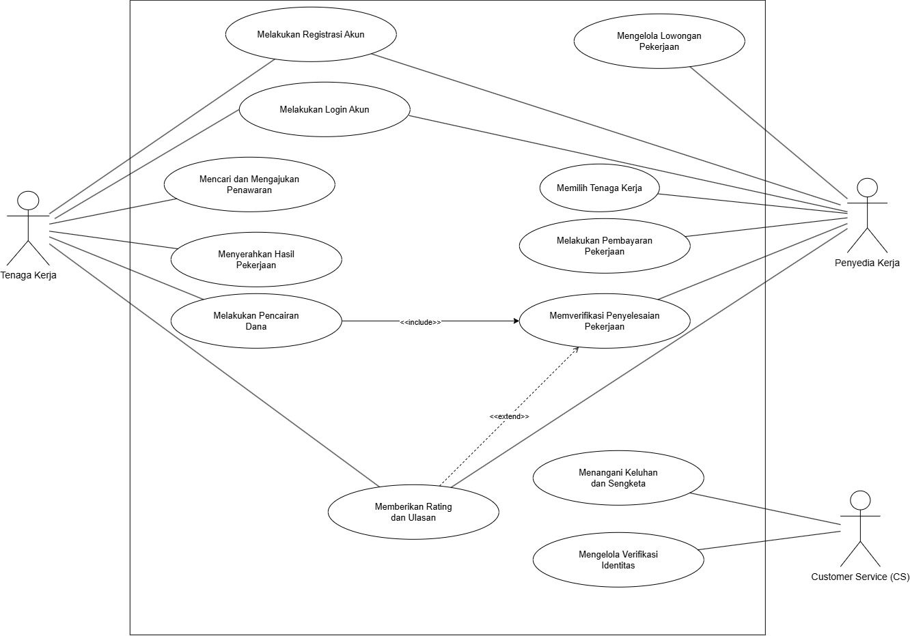

<i>Gambar 1. Use Case Diagram</i>

 

## 3.4 Skenario Use Case
Buat skenario untuk **setiap** use case yang telah diidentifikasi pada 3.2. Setiap skenario dapat terdiri dari dua jenis alur:
- **Skenario Normal**: alur utama (*happy path*) di mana interaksi aktor-sistem berjalan lancar tanpa kendala hingga tujuan use case tercapai.
- **Skenario Alternatif**: alur percabangan dari skenario normal, misalnya kondisi gagal, input tidak valid, atau pilihan lain yang tersedia bagi aktor. Boleh ada lebih dari satu skenario alternatif per use case jika ada beberapa titik percabangan berbeda.

Format tabel skenario: kolom **Aksi Aktor** berisi apa yang dilakukan/diinput aktor, kolom **Reaksi Perangkat Lunak** berisi respons sistem terhadap aksi tersebut secara **berurutan** (nomor langkah harus berpasangan/selaras antar dua kolom).

### 3.4.1 Skenario UC01

**Nama Use Case:** *Melakukan Registrasi*

**Skenario Normal**

| No | Aksi Aktor | Reaksi Perangkat Lunak |
| :--- | :--- | :--- |
| 1 | Pengguna memilih opsi registrasi | Sistem menampilkan formulir registrasi, pilihan peran (Tenaga Kerja atau Penyedia Kerja), dan meminta persetujuan kebijakan privasi |
| 2 | Pengguna mengisi formulir profil lengkap, memasukkan tanggal lahir (usia $\ge$ 17 tahun), dan menyetujui kebijakan privasi lalu menekan daftar | Sistem memvalidasi usia pendaftar dan menyimpan data pengguna |
| 3 | Pengguna melakukan login dengan kredensial yang baru dibuat | Sistem memverifikasi kredensial, menerbitkan token autentikasi, dan menampilkan halaman beranda |

 

**Skenario Alternatif 1: Batas Usia Tidak Valid**

| No | Aksi Aktor | Reaksi Perangkat Lunak |
| :--- | :--- | :--- |
| 1 | Pengguna memilih opsi registrasi | Sistem menampilkan formulir registrasi, pilihan peran, dan kebijakan privasi |
| 2 | Pengguna memasukkan tanggal lahir yang menunjukkan usia di bawah 17 tahun dan menekan daftar | Sistem memblokir pendaftaran dan menampilkan pesan kesalahan bahwa pengguna harus berusia minimal 17 tahun |
| 3 | Pengguna memperbaiki input tanggal lahir menjadi valid | Sistem kembali ke langkah 2 skenario normal |

 

**Skenario Alternatif 2: Email Sudah Terdaftar**

| No | Aksi Aktor | Reaksi Perangkat Lunak |
| :--- | :--- | :--- |
| 1 | Pengguna memilih opsi registrasi | Sistem menampilkan formulir registrasi, pilihan peran, dan kebijakan privasi |
| 2 | Pengguna mengisi formulir dengan email yang sudah ada di basis data dan menekan daftar | Sistem menolak pendaftaran dan menampilkan pesan bahwa email sudah digunakan, serta menyarankan pengguna untuk login |
| 3 | Pengguna memilih opsi menuju halaman login | Sistem mengarahkan pengguna ke halaman login |

 

### 3.4.2 Skenario UC02

**Nama Use Case:** *Mengelola Verifikasi Identitas*

**Skenario Normal**

| No | Aksi Aktor | Reaksi Perangkat Lunak |
| :--- | :--- | :--- |
| 1 | Tenaga Kerja memilih menu verifikasi identitas | Sistem menampilkan antarmuka pengunggahan dokumen identitas |
| 2 | Tenaga Kerja mengunggah dokumen dan mengirimkan pengajuan | Sistem menyimpan dokumen dan mengubah status menjadi "Menunggu Persetujuan" |
| 3 | Customer Service menekan tombol setuju verifikasi manual pada dashboard | Sistem memperbarui status identitas pengguna menjadi "Terverifikasi" dan membuka akses fitur utama platform |

 

**Skenario Alternatif 1: Format atau Ukuran Dokumen Tidak Valid**

| No | Aksi Aktor | Reaksi Perangkat Lunak |
| :--- | :--- | :--- |
| 1 | Tenaga Kerja memilih menu verifikasi identitas | Sistem menampilkan antarmuka pengunggahan dokumen identitas |
| 2 | Tenaga Kerja mengunggah file dengan ekstensi yang tidak didukung (misal: .exe) atau melebihi batas ukuran (misal: > 5MB) | Sistem menolak unggahan dan menampilkan pesan error format/ukuran file tidak sesuai |

 

**Skenario Alternatif 2: Dokumen Ditolak oleh Customer Service**

| No | Aksi Aktor | Reaksi Perangkat Lunak |
| :--- | :--- | :--- |
| 1 | Tenaga Kerja memilih menu verifikasi identitas | Sistem menampilkan antarmuka pengunggahan dokumen identitas |
| 2 | Tenaga Kerja mengunggah dokumen yang buram atau data tidak cocok | Sistem menyimpan dokumen sebagai "Menunggu Persetujuan" |
| 3 | Customer Service menolak verifikasi pada dashboard dengan memberikan alasan | Sistem memperbarui status menjadi "Ditolak", mengirim notifikasi revisi beserta alasan, dan fitur utama tetap dibatasi |

 

**Skenario Alternatif 3: Mengakses Fitur Utama Sebelum Terverifikasi**

| No | Aksi Aktor | Reaksi Perangkat Lunak |
| :--- | :--- | :--- |
| 1 | Tenaga Kerja (dengan status belum terverifikasi) mencoba menekan menu fitur utama platform | Sistem mendeteksi status akun belum disetujui |
| 2 | Sistem memblokir akses ke halaman tersebut | Sistem menampilkan pop-up peringatan bahwa akun harus diverifikasi dan mengarahkan pengguna ke halaman verifikasi |

### 3.4.3 Skenario UC03

**Nama Use Case:** *Mengelola Lowongan Pekerjaan*

**Skenario Normal**

| No | Aksi Aktor | Reaksi Perangkat Lunak |
| :--- | :--- | :--- |
| 1 | Penyedia Kerja memilih opsi buat lowongan baru | Sistem menampilkan antarmuka formulir lowongan pekerjaan |
| 2 | Penyedia Kerja mengisi seluruh isian (judul, deskripsi, kuota, lokasi, upah) secara lengkap lalu menekan simpan | Sistem memvalidasi isian, menyimpan lowongan, dan menetapkan status bawaan menjadi "Open" |

 

**Skenario Alternatif 1: Isian Formulir Kosong atau Tidak Valid**

| No | Aksi Aktor | Reaksi Perangkat Lunak |
| :--- | :--- | :--- |
| 1 | Penyedia Kerja memilih opsi buat lowongan baru | Sistem menampilkan antarmuka formulir lowongan pekerjaan |
| 2 | Penyedia Kerja mengosongkan bagian upah atau kuota dan menekan simpan | Sistem mendeteksi isian tidak valid, menggagalkan penyimpanan, dan menampilkan pesan peringatan atribut mana yang masih kosong |
| 3 | Penyedia Kerja melengkapi isian yang kosong dengan data valid | Sistem kembali ke langkah 2 skenario normal |

 

**Skenario Alternatif 2: Membatalkan Pembuatan Lowongan**

| No | Aksi Aktor | Reaksi Perangkat Lunak |
| :--- | :--- | :--- |
| 1 | Penyedia Kerja memilih opsi buat lowongan baru | Sistem menampilkan antarmuka formulir lowongan pekerjaan |
| 2 | Penyedia Kerja mengisi sebagian isian, lalu menekan tombol batal | Sistem membuang isian yang belum disimpan dan mengarahkan pengguna kembali ke halaman beranda/daftar lowongan |

---

### 3.4.4 Skenario UC04

**Nama Use Case:** *Mencari Lowongan Pekerjaan*

**Skenario Normal**

| No | Aksi Aktor | Reaksi Perangkat Lunak |
| :--- | :--- | :--- |
| 1 | Tenaga Kerja membuka halaman pencarian pekerjaan atau memasukkan parameter filter seperti kategori/keterampilan | Sistem memproses kriteria pencarian dari pengguna |
| 2 | Tenaga Kerja menekan tombol cari/terapkan filter | Sistem merender dan menampilkan daftar lowongan pekerjaan yang berstatus "Open" sesuai dengan kriteria yang diminta |

 

**Skenario Alternatif 1: Pencarian Tidak Ditemukan**

| No | Aksi Aktor | Reaksi Perangkat Lunak |
| :--- | :--- | :--- |
| 1 | Tenaga Kerja memasukkan kata kunci keterampilan yang sangat spesifik di kolom pencarian | Sistem memfilter lowongan berstatus "Open" dan tidak menemukan kecocokan data |
| 2 | Tenaga Kerja menekan tombol cari | Sistem menampilkan halaman kosong dengan pesan "Tidak ada lowongan yang sesuai dengan pencarian Anda" |

 

### 3.4.5 Skenario UC05

**Nama Use Case:** *Mengajukan Penawaran Pekerjaan*

**Skenario Normal**

| No | Aksi Aktor | Reaksi Perangkat Lunak |
| :--- | :--- | :--- |
| 1 | Tenaga Kerja dengan status akun Terverifikasi membuka halaman detail lowongan pekerjaan | Sistem memvalidasi status akun dan menampilkan tombol "Ajukan Penawaran" pada halaman tersebut |
| 2 | Tenaga Kerja menekan tombol "Ajukan Penawaran" | Sistem menampilkan antarmuka formulir pengajuan penawaran |
| 3 | Tenaga Kerja mengisi pesan penawaran dan menekan tombol konfirmasi pengajuan | Sistem menyimpan data pengajuan (ID Tenaga Kerja, ID Lowongan, pesan, dan timestamp) ke basis data, lalu menampilkan notifikasi keberhasilan |

 

**Skenario Alternatif 1: Akun Belum Terverifikasi**

| No | Aksi Aktor | Reaksi Perangkat Lunak |
| :--- | :--- | :--- |
| 1 | Tenaga Kerja dengan status akun Belum Terverifikasi membuka halaman detail lowongan pekerjaan | Sistem tidak menampilkan tombol "Ajukan Penawaran" atau menonaktifkannya dan memunculkan peringatan bahwa pengguna harus menyelesaikan verifikasi identitas terlebih dahulu |

**Skenario Alternatif 2: Pembatalan Pengajuan**

| No | Aksi Aktor | Reaksi Perangkat Lunak |
| :--- | :--- | :--- |
| 1 | Tenaga Kerja menekan tombol "Ajukan Penawaran" pada detail pekerjaan | Sistem menampilkan antarmuka formulir pengajuan penawaran |
| 2 | Tenaga Kerja berubah pikiran dan menekan tombol "Batal" atau "Kembali" | Sistem menutup formulir pengajuan dan mengembalikan tampilan ke halaman detail pekerjaan tanpa menyimpan data apapun |

 

### 3.4.6 Skenario UC06

**Nama Use Case:** *Memilih Tenaga Kerja*
**Aktor:** Penyedia Kerja
**Deskripsi:** Penyedia Kerja meninjau daftar pelamar yang mengajukan penawaran pada lowongan pekerjaannya dan menyetujui kandidat yang sesuai, memicu pencatatan ID transaksi unik serta pembaruan status lowongan menjadi *Closed/Full* jika kuota telah terpenuhi.
**Kebutuhan Terkait:** KF12, KF13

**Skenario Normal**

| No | Aksi Aktor | Reaksi Perangkat Lunak |
| :--- | :--- | :--- |
| 1 | Penyedia Kerja membuka halaman lowongan miliknya dan memilih tab "Daftar Pelamar". | Sistem memuat dan menampilkan daftar pelamar yang telah mengajukan penawaran beserta profil singkat, pesan penawaran, rating, dan portofolio pelamar. |
| 2 | Penyedia Kerja meninjau profil pelamar dan menekan tombol "Pilih" pada salah satu kandidat yang cocok. | Sistem menampilkan dialog konfirmasi persetujuan pelamar beserta rincian lowongan dan sisa kuota yang tersedia. |
| 3 | Penyedia Kerja mengonfirmasi persetujuan kandidat tersebut. | Sistem memvalidasi sisa kuota lowongan, membuat entri ID Transaksi Pekerjaan yang unik antara Penyedia Kerja dan Tenaga Kerja terpilih, serta mengubah status pelamar menjadi "Accepted". |
| 4 | - | Sistem memeriksa jumlah pelamar yang disetujui. Karena kuota telah terpenuhi, sistem secara otomatis mengubah status lowongan dari "Open" menjadi "Closed/Full" dan menampilkan pesan berhasil. |

 

**Skenario Alternatif 1: Kuota Lowongan Sudah Penuh Saat Konfirmasi**

| No | Aksi Aktor | Reaksi Perangkat Lunak |
| :--- | :--- | :--- |
| 1 | Penyedia Kerja membuka daftar pelamar dan menekan tombol "Pilih" pada kandidat. | Sistem menampilkan dialog konfirmasi persetujuan. |
| 2 | Penyedia Kerja mengonfirmasi persetujuan kandidat. | Sistem mendeteksi bahwa kuota penerimaan untuk lowongan tersebut sudah penuh. |
| 3 | - | Sistem membatalkan aksi persetujuan, memperbarui status lowongan menjadi "Closed/Full", dan menampilkan pesan error bahwa kuota lowongan telah penuh. |

 

**Skenario Alternatif 2: Penyedia Kerja Membatalkan Pemilihan Pelamar**

| No | Aksi Aktor | Reaksi Perangkat Lunak |
| :--- | :--- | :--- |
| 1 | Penyedia Kerja menekan tombol "Pilih" pada kandidat. | Sistem menampilkan dialog konfirmasi persetujuan kandidat. |
| 2 | Penyedia Kerja menekan tombol "Batal". | Sistem menutup dialog konfirmasi dan mempertahankan status daftar pelamar tanpa ada perubahan data. |

---

### 3.4.7 Skenario UC07

**Nama Use Case:** *Melakukan Pembayaran Pekerjaan*
**Aktor:** Penyedia Kerja
**Deskripsi:** Penyedia Kerja melakukan pembayaran upah pekerjaan beserta biaya komisi (*commission fee*) melalui *Payment Gateway* sebelum pekerjaan dapat dimulai (*In Progress*).
**Kebutuhan Terkait:** KF14, KF15

**Skenario Normal**

| No | Aksi Aktor | Reaksi Perangkat Lunak |
| :--- | :--- | :--- |
| 1 | Penyedia Kerja membuka rincian transaksi pekerjaan yang telah disepakati dan menekan tombol "Bayar". | Sistem menghitung total rincian tagihan (upah tenaga kerja + *commission fee* platform) dan menampilkan rincian pembayaran beserta tombol instruksi pembayaran. |
| 2 | Penyedia Kerja memilih metode pembayaran dan menekan "Lanjutkan Pembayaran". | Sistem menghubungi API Payment Gateway, menerbitkan ID tagihan/pembayaran, dan menampilkan kode pembayaran / tautan transaksi. |
| 3 | Penyedia Kerja menyelesaikan pembayaran melalui metode pembayaran yang dipilih. | Sistem menerima notifikasi konfirmasi pembayaran berhasil dari Payment Gateway. |
| 4 | - | Sistem memverifikasi pembayaran, mencatat riwayat transaksi, mengubah status pekerjaan dari "Assigned" menjadi "In Progress", serta mengirimkan notifikasi kepada Tenaga Kerja bahwa pekerjaan siap dimulai. |

 

**Skenario Alternatif 1: Pembayaran Gagal atau Dibatalkan oleh Payment Gateway**

| No | Aksi Aktor | Reaksi Perangkat Lunak |
| :--- | :--- | :--- |
| 1 | Penyedia Kerja memilih metode pembayaran dan menekan "Lanjutkan Pembayaran". | Sistem mengarahkan Penyedia Kerja ke halaman transaksi Payment Gateway. |
| 2 | Pembayaran gagal diproses oleh saluran pembayaran (misal: saldo tidak mencukupi atau transaksi ditolak). | Sistem menerima notifikasi kegagalan transaksi dari Payment Gateway, mencatat status transaksi sebagai "Failed", dan menampilkan pesan kesalahan kepada Penyedia Kerja beserta opsi untuk mencoba metode pembayaran lain. |
| 3 | Penyedia Kerja memilih opsi metode pembayaran lain. | Sistem kembali ke langkah 2 skenario normal untuk membuat instruksi pembayaran baru. |

 

**Skenario Alternatif 2: Waktu Pembayaran Habis (Timeout / Expired)**

| No | Aksi Aktor | Reaksi Perangkat Lunak |
| :--- | :--- | :--- |
| 1 | Penyedia Kerja mendapatkan kode pembayaran dengan batas waktu tertentu. | Sistem mencatat batas waktu pembayaran (*expiry timestamp*) dan menunggu konfirmasi pembayaran. |
| 2 | Penyedia Kerja tidak melakukan pembayaran hingga batas waktu terlewati. | Sistem menerima notifikasi kedaluwarsa dari Payment Gateway, mencatat status pembayaran "Expired", dan mengembalikan status transaksi ke antrean tagihan yang belum dibayar. |

---

### 3.4.8 Skenario UC08

**Nama Use Case:** *Menyerahkan Hasil Pekerjaan*
**Aktor:** Tenaga Kerja
**Deskripsi:** Tenaga Kerja mengunggah berkas bukti atau lampiran penyelesaian tugas ke sistem untuk diserahkan kepada Penyedia Kerja, mengubah status pekerjaan menjadi *Submitted*.
**Kebutuhan Terkait:** KF16

**Skenario Normal**

| No | Aksi Aktor | Reaksi Perangkat Lunak |
| :--- | :--- | :--- |
| 1 | Tenaga Kerja membuka halaman detail pekerjaan aktif  yang berstatus "In Progress" dan menekan tombol "Serahkan Hasil Pekerjaan". | Sistem menampilkan formulir penyerahan pekerjaan yang berisi catatan penyelesaian dan kolom pengunggahan berkas bukti/lampiran. |
| 2 | Tenaga Kerja mengisi deskripsi pengerjaan, mengunggah berkas bukti (foto/dokumen dengan limit ukuran file), dan menekan tombol "Kirim Hasil Pekerjaan". | Sistem memvalidasi kelengkapan isian serta format dan ukuran berkas yang diunggah. |
| 3 | Tenaga Kerja mengonfirmasi penyerahan pada bukti konfirmasi akhir. | Sistem menyimpan berkas lampiran, mencatat stempel waktu pengiriman (*timestamp*), mengubah status pekerjaan menjadi "Submitted", serta mengirimkan notifikasi peninjauan hasil kepada Penyedia Kerja. |

 

**Skenario Alternatif 1: Ukuran Berkas Melebihi Batas Maksimal**

| No | Aksi Aktor | Reaksi Perangkat Lunak |
| :--- | :--- | :--- |
| 1 | Tenaga Kerja memilih berkas bukti yang berukuran lebih besar dari batas ketentuan (misal > 10 MB). | Sistem mendeteksi ukuran berkas melebihi kuota penyimpanan yang diizinkan. |
| 2 | - | Sistem menggagalkan pengunggahan berkas, menampilkan pesan peringatan "Ukuran berkas melebihi batas maksimal 10 MB", dan meminta Tenaga Kerja memilih berkas lain. |
| 3 | Tenaga Kerja memilih berkas baru yang sesuai dengan batasan ukuran. | Sistem memvalidasi berkas baru dan kembali ke langkah 2 skenario normal. |

 

**Skenario Alternatif 2: Tenaga Kerja Belum Mengunggah Berkas Wajib**

| No | Aksi Aktor | Reaksi Perangkat Lunak |
| :--- | :--- | :--- |
| 1 | Tenaga Kerja mengosongkan kolom lampiran bukti dan langsung menekan tombol "Kirim Hasil Pekerjaan". | Sistem mendeteksi bahwa bukti pengerjaan wajib dilampirkan. |
| 2 | - | Sistem menampilkan pesan peringatan bahwa bukti pekerjaan tidak boleh kosong dan menolak pengiriman formulir hingga berkas diunggah. |

---

### 3.4.9 Skenario UC09

**Nama Use Case:** *Memverifikasi Penyelesaian Pekerjaan*
**Aktor:** Penyedia Kerja
**Deskripsi:** Penyedia Kerja meninjau hasil pekerjaan yang diserahkan oleh Tenaga Kerja, mengonfirmasi penyelesaian tugas, mengubah status menjadi *Completed*, dan memicu instruksi pencairan upah ke saldo Tenaga Kerja.
**Kebutuhan Terkait:** KF17, KF18

**Skenario Normal**

| No | Aksi Aktor | Reaksi Perangkat Lunak |
| :--- | :--- | :--- |
| 1 | Penyedia Kerja membuka halaman rincian pekerjaan yang berstatus "Submitted". | Sistem menampilkan deskripsi hasil pekerjaan beserta lampiran bukti pengerjaan yang telah diunggah Tenaga Kerja. |
| 2 | Penyedia Kerja memeriksa hasil kerja dan menekan tombol "Konfirmasi Selesai". | Sistem menampilkan bukti konfirmasi penyelesaian pekerjaan dengan peringatan bahwa dana upah akan langsung diteruskan ke Tenaga Kerja. |
| 3 | Penyedia Kerja mengonfirmasi persetujuan hasil kerja. | Sistem mengubah status pekerjaan menjadi "Completed", memicu instruksi penyaluran upah ke akun Tenaga Kerja, memperbarui saldo pendapatan Tenaga Kerja, dan mengirimkan notifikasi penerimaan upah. |
| 4 | - | Sistem secara otomatis mengarahkan Penyedia Kerja ke antarmuka formulir rating dan ulasan (UC10). |

 

**Skenario Alternatif 1: Hasil Pekerjaan Belum Sesuai (Penyedia Kerja Meminta Revisi)**

| No | Aksi Aktor | Reaksi Perangkat Lunak |
| :--- | :--- | :--- |
| 1 | Penyedia Kerja memeriksa hasil kerja dan mendapati hasil pekerjaan belum sesuai kesepakatan. | Penyedia Kerja menekan tombol "Minta Revisi / Perbaikan". |
| 2 | Penyedia Kerja mengisi catatan kekurangan pekerjaan pada kolom deskripsi revisi dan menekan "Kirim Permintaan Revisi". | Sistem menyimpan catatan revisi, mengembalikan status pekerjaan menjadi "In Progress", serta mengirimkan notifikasi permintaan revisi kepada Tenaga Kerja. |

 

**Skenario Alternatif 2: Terjadi Ketidaksepakatan / Perselisihan Hasil Kerja**

| No | Aksi Aktor | Reaksi Perangkat Lunak |
| :--- | :--- | :--- |
| 1 | Penyedia Kerja memeriksa hasil pekerjaan namun Tenaga Kerja tidak menyelesaikan tanggung jawab sama sekali atau melanggar kesepakatan. | Penyedia Kerja menekan tombol "Ajukan Komplain". |
| 2 | - | Sistem mengarahkan Penyedia Kerja ke alur penanganan sengketa (UC11 / Menangani Keluhan dan Sengketa) serta menahan status dana pekerjaan. |

 

### 3.4.10 Skenario UC10

**Nama Use Case:** *Melakukan Pencairan Dana*
**Aktor:** Tenaga Kerja
**Deskripsi:** Tenaga Kerja menarik upah yang telah terkumpul ke rekening bank atau e-wallet melalui sistem Payment Gateway.
**Kebutuhan Terkait:** KF19, KF20

**Skenario Normal**

| No | Aksi Aktor | Reaksi Perangkat Lunak |
| :--- | :--- | :--- |
| 1 | Tenaga Kerja membuka halaman saldo/dompet dan menekan tombol "Tarik Dana". | Sistem menampilkan formulir pencairan dana beserta saldo yang tersedia dan kolom pilihan rekening bank/e-wallet tujuan. |
| 2 | Tenaga Kerja memilih rekening tujuan, memasukkan nominal penarikan, dan menekan "Ajukan Pencairan". | Sistem memvalidasi data rekening tujuan dan nominal penarikan terhadap saldo yang tersedia. |
| 3 | Tenaga Kerja mengonfirmasi pengajuan pencairan. | Sistem mengubah status pencairan menjadi "Diproses". |
| 4 | - | Sistem menerima konfirmasi transfer berhasil dari Payment Gateway, mencatat log pencairan (ID transaksi, nominal, identitas penerima, waktu, status transfer), mengurangi saldo, dan menampilkan notifikasi bahwa pencairan berhasil. |

 

**Skenario Alternatif 1: Data Rekening/E-wallet Tidak Valid**

| No | Aksi Aktor | Reaksi Perangkat Lunak |
| :--- | :--- | :--- |
| 1 | Tenaga Kerja memasukkan nomor rekening/e-wallet dengan format tidak valid dan menekan "Ajukan Pencairan". | Sistem gagal memvalidasi data rekening tujuan. |
| 2 | - | Sistem menampilkan pesan kesalahan bahwa data rekening tidak valid dan meminta Tenaga Kerja memeriksa kembali data tujuan. |

 

**Skenario Alternatif 2: Nominal Penarikan Melebihi Saldo**

| No | Aksi Aktor | Reaksi Perangkat Lunak |
| :--- | :--- | :--- |
| 1 | Tenaga Kerja memasukkan nominal penarikan yang lebih besar dari saldo yang tersedia. | Sistem mendeteksi nominal melebihi saldo tersedia. |
| 2 | - | Sistem menolak pengajuan, menampilkan pesan peringatan saldo tidak mencukupi, dan menggagalkan pengiriman instruksi ke Payment Gateway. |

 

### 3.4.11 Skenario UC11

**Nama Use Case:** *Memberikan Penilaian Kerja*
**Aktor:** Tenaga Kerja, Penyedia Kerja
**Deskripsi:** Pengguna memberikan penilaian performa (rating skala 1–5) dan ulasan setelah suatu pekerjaan selesai, yang digunakan untuk memperbarui portofolio dan reputasi pengguna yang dinilai.
**Kebutuhan Terkait:** KF21, KF22, KF23

**Skenario Normal**

| No | Aksi Aktor | Reaksi Perangkat Lunak |
| :--- | :--- | :--- |
| 1 | Pengguna membuka halaman pekerjaan berstatus "Completed" dan menekan "Beri Rating & Ulasan". | Sistem menampilkan formulir rating (skala 1–5) dan kolom ulasan teks. |
| 2 | Pengguna memilih nilai rating, mengisi ulasan, dan menekan "Kirim Ulasan". | Sistem memvalidasi kelengkapan isian dan menyimpan data rating serta ulasan ke basis data. |
| 3 | - | Sistem mengunci formulir ulasan untuk pekerjaan tersebut, menghitung ulang rata-rata rating pengguna yang dinilai, dan memperbarui tampilan portofolio pada profilnya. |

 

**Skenario Alternatif 1: Pengiriman Ulasan Ganda**

| No | Aksi Aktor | Reaksi Perangkat Lunak |
| :--- | :--- | :--- |
| 1 | Pengguna yang sudah pernah mengirim ulasan mencoba membuka kembali formulir ulasan untuk pekerjaan yang sama. | Sistem mendeteksi bahwa ulasan untuk pekerjaan tersebut sudah pernah dikirim. |
| 2 | - | Sistem mengunci formulir, menampilkan pesan bahwa ulasan sudah pernah diberikan, dan menolak pengiriman ulasan tambahan. |

 

**Skenario Alternatif 2: Rating Tidak Diisi**

| No | Aksi Aktor | Reaksi Perangkat Lunak |
| :--- | :--- | :--- |
| 1 | Pengguna mengosongkan kolom rating dan langsung menekan "Kirim Ulasan". | Sistem mendeteksi rating wajib belum dipilih. |
| 2 | - | Sistem menampilkan pesan peringatan bahwa rating wajib diisi dan menggagalkan pengiriman formulir. |

 

### 3.4.12 Skenario UC12

**Nama Use Case:** *Menangani Keluhan*
**Aktor:** Tenaga Kerja, Penyedia Kerja, Customer Service
**Deskripsi:** Pengguna melaporkan kendala atau sengketa terkait suatu pekerjaan, yang kemudian ditinjau, ditengahi, dan diputuskan oleh Customer Service, termasuk eksekusi refund atau pencairan dana sesuai bukti.
**Kebutuhan Terkait:** KF24, KF25, KF26

**Skenario Normal**

| No | Aksi Aktor | Reaksi Perangkat Lunak |
| :--- | :--- | :--- |
| 1 | Pengguna membuka halaman pekerjaan bermasalah dan menekan "Ajukan Komplain/Keluhan". | Sistem menampilkan formulir laporan berisi kategori masalah, deskripsi, dan kolom unggah bukti pendukung. |
| 2 | Pengguna mengisi deskripsi keluhan, mengunggah bukti pendukung, dan menekan "Kirim Laporan". | Sistem menerbitkan tiket sengketa baru, menyimpan bukti yang diunggah, dan menampilkannya pada dashboard Customer Service. |
| 3 | Customer Service meninjau tiket, memeriksa bukti dari kedua pihak, dan menetapkan keputusan sengketa. | Sistem mengeksekusi tindakan sesuai keputusan (refund ke Penyedia Kerja / pencairan dana ke Tenaga Kerja) dan mencatat perubahan status penanganan. |
| 4 | - | Sistem mencatat riwayat aktivitas penanganan sengketa secara kronologis dan mengirimkan notifikasi hasil keputusan kepada kedua pihak terkait. |

 

**Skenario Alternatif 1: Permintaan Bukti Tambahan**

| No | Aksi Aktor | Reaksi Perangkat Lunak |
| :--- | :--- | :--- |
| 1 | Customer Service menilai bukti yang diberikan belum cukup dan menekan "Minta Bukti Tambahan". | Sistem mengirimkan notifikasi permintaan bukti tambahan kepada pihak terkait dan mencatatnya dalam riwayat penanganan. |
| 2 | Pengguna mengunggah bukti tambahan yang diminta. | Sistem menyimpan bukti baru dan kembali ke langkah 3 skenario normal. |

 

**Skenario Alternatif 2: Keluhan Ditolak karena Bukti Tidak Cukup**

| No | Aksi Aktor | Reaksi Perangkat Lunak |
| :--- | :--- | :--- |
| 1 | Customer Service menetapkan bahwa laporan tidak memiliki dasar/bukti yang valid. | Sistem mengubah status tiket menjadi "Ditolak". |
| 2 | - | Sistem mencatat alasan penolakan dalam riwayat penanganan dan mengirimkan notifikasi penolakan kepada pelapor tanpa mengeksekusi refund/pencairan. |

 

**Skenario Alternatif 3: Pengguna Membatalkan Tiket Keluhan**

| No | Aksi Aktor | Reaksi Perangkat Lunak |
| :--- | :--- | :--- |
| 1 | Pelapor membuka tiket sengketa berstatus "Menunggu Peninjauan" dan menekan "Batalkan Laporan". | Sistem menampilkan konfirmasi pembatalan tiket. |
| 2 | Pelapor mengonfirmasi pembatalan. | Sistem mengubah status tiket menjadi "Dibatalkan", mencatat pembatalan dalam riwayat penanganan, dan melepas penahanan dana pekerjaan (jika ada). |

---

# BAB 4: Diagram Kelas
Bagian ini berisi identifikasi kelas dan pemodelan struktur kelas yang diperlukan untuk merealisasikan use case pada BAB 3. Gunakan skenario use case (3.4) sebagai dasar untuk menentukan kelas, atribut, metode, dan hubungan antarkelas.

## 4.1 Identifikasi Kelas
Identifikasi seluruh kelas yang diperlukan berdasarkan use case dan skenarionya. Satu kelas boleh terkait dengan lebih dari satu use case.

| ID Kelas | Nama Kelas | Deskripsi Kelas | ID Use Case |
| :--- | :--- | :--- | :--- |
| C01 | Pengguna | Kelas abstrak yang menyimpan data dasar akun seperti nama, email, *password* terenkripsi, tanggal lahir (untuk validasi usia), dan token autentikasi. | UC01 |
| C02 | TenagaKerja | Turunan dari kelas `Pengguna`. Menyimpan data spesifik pekerja seperti status verifikasi, saldo pendapatan, dan portofolio pekerjaan. | UC01, UC02, UC04, UC05, UC08, UC10, UC11 |
| C03 | PenyediaKerja | Turunan dari kelas `Pengguna`. Menyimpan data spesifik pencari jasa yang memiliki kemampuan untuk membuat lowongan dan melakukan pembayaran. | UC01, UC03, UC06, UC07, UC09, UC11 |
| C04 | CustomerService | Turunan dari kelas `Pengguna`. Menyimpan hak akses operasional internal platform untuk menangani verifikasi manual dan permasalahan sengketa. | UC02, UC12 |
| C05 | VerifikasiIdentitas | Menyimpan data pengajuan verifikasi oleh Tenaga Kerja, mencakup file dokumen identitas (KTP), *timestamp* pengajuan, alasan penolakan (jika ada), dan status persetujuan. | UC02 |
| C06 | LowonganPekerjaan | Menyimpan rincian spesifikasi pekerjaan yang dibuat Penyedia Kerja, meliputi judul, deskripsi, lokasi (jika diperlukan), batas kuota, nominal upah, dan status ketersediaan (*Open*, *Closed/Full*). | UC03, UC04, UC05, UC06 |
| C07 | PengajuanPenawaran | Menyimpan data lamaran dari Tenaga Kerja untuk suatu lowongan. Berisi pesan penawaran, *timestamp*, dan status lamaran (*Pending*, *Accepted*, *Rejected*). | UC05, UC06 |
| C08 | TransaksiPekerjaan | Menyimpan ID transaksi unik dan melacak siklus hidup pengerjaan dengan status seperti *Assigned*, *In Progress*, *Submitted*, *Completed*, atau *Disputed*. Kelas ini digunakan, ketika pelamar telah disetujui. | UC06, UC07, UC08, UC09, UC11, UC12 |
| C09 | BuktiPenyerahan | Menyimpan data penyerahan hasil kerja dari Tenaga Kerja, mencakup deskripsi pengerjaan, file lampiran bukti (dengan validasi ukuran file), dan *timestamp* pengiriman. | UC08, UC09 |
| C10 | TagihanPembayaran | Menyimpan rincian *invoice* sebelum pekerjaan dimulai, meliputi ID Tagihan, total nominal (upah + *commission fee*), batas waktu pembayaran (*expired time*), dan status pembayaran. | UC07 |
| C11 | PencairanDana | Menyimpan data permintaan penarikan saldo oleh Tenaga Kerja, mencakup nominal, data bank/e-wallet tujuan, *timestamp*, dan status transfer. | UC10 |
| C12 | PaymentGateway | Bertanggung jawab meneruskan instruksi pembayaran dan pencairan dana ke sistem eksternal, serta menerima status transaksi (berhasil, gagal, atau *expired*). | UC07, UC10 |
| C13 | UlasanRating | Menyimpan data penilaian pasca-pekerjaan, meliputi nilai (skala 1-5), deskripsi ulasan teks, dan ID transaksi terkait untuk memastikan tidak ada pengiriman ulasan ganda. | UC11 |
| C14 | TiketSengketa | Menyimpan data laporan keluhan, meliputi kategori masalah, deskripsi komplain, file bukti pendukung awal, dan status tiket sengketa (*Open*, *Need More Proof*, *Resolved*, *Rejected*). | UC12 |
| C15 | RiwayatSengketa | Menyimpan log atau rekam jejak aktivitas secara kronologis pada suatu tiket sengketa, seperti penambahan bukti susulan dan eksekusi keputusan (*refund*/pencairan) oleh Customer Service. | UC12 |
| C16 | Notifikasi | Menyimpan dan mengelola pengiriman pesan pemberitahuan ke *dashboard* pengguna (misalnya notifikasi penerimaan pelamar, pembayaran berhasil, revisi, atau penerimaan upah). | UC02, UC05, UC07, UC08, UC09, UC12 |

Pastikan setiap kelas memiliki tanggung jawab yang jelas dan memang diperlukan untuk merealisasikan fungsi yang dimodelkan. Hindari kelas yang tidak memiliki keterkaitan dengan KF atau use case manapun.

## 4.2 Diagram Kelas per Use Case
Buat diagram kelas untuk setiap use case pada 3.2.

### 4.2.1 Use Case UC01

**Nama Use Case:** *Melakukan Registrasi*

#### Identifikasi Kelas

| ID Kelas | Nama Kelas | Deskripsi Kelas |
| :--- | :--- | :--- |
| C01 | Pengguna | Kelas abstrak yang menyimpan data dasar akun seperti nama, email, *password* terenkripsi, tanggal lahir (untuk validasi usia), dan token autentikasi. |
| C02 | TenagaKerja | Turunan dari kelas `Pengguna`. Menyimpan data spesifik pekerja seperti status verifikasi, saldo pendapatan, dan portofolio pekerjaan. |
| C03 | PenyediaKerja | Turunan dari kelas `Pengguna`. Menyimpan data spesifik pencari jasa yang memiliki kemampuan untuk membuat lowongan dan melakukan pembayaran. |

#### Diagram Kelas

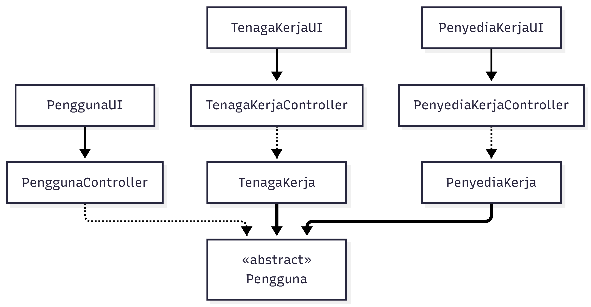

<i>Gambar 2. Diagram Kelas Use Case UC01</i>

 

| ID Kelas | Nama Kelas | Atribut | Metode/Operasi |
| :--- | :--- | :--- | :--- |
| C01 | Pengguna | id_pengguna, nama, email, password, tanggal_lahir, token_auth | registrasi(), validasiUsia(), login(), generateToken() |
| C02 | TenagaKerja | status_verifikasi, saldo_pendapatan, rating_akumulatif | buatProfil() |
| C03 | PenyediaKerja | - | buatProfil() |

### 4.2.2 Use Case UC02

**Nama Use Case:** *Mengelola Verifikasi Identitas*

#### Identifikasi Kelas

| ID Kelas | Nama Kelas | Deskripsi Kelas |
| :--- | :--- | :--- |
| C02 | TenagaKerja | Turunan dari kelas `Pengguna`. Menyimpan data spesifik pekerja seperti status verifikasi, saldo pendapatan, dan portofolio pekerjaan. |
| C04 | CustomerService | Turunan dari kelas `Pengguna`. Menyimpan hak akses operasional internal platform untuk menangani verifikasi manual dan permasalahan sengketa. |
| C05 | VerifikasiIdentitas | Menyimpan data pengajuan verifikasi oleh Tenaga Kerja, mencakup file dokumen identitas (KTP), *timestamp* pengajuan, alasan penolakan (jika ada), dan status persetujuan. |
| C16 | Notifikasi | Menyimpan dan mengelola pengiriman pesan pemberitahuan ke *dashboard* pengguna (misalnya notifikasi penerimaan pelamar, pembayaran berhasil, revisi, atau penerimaan upah). |

#### Diagram Kelas

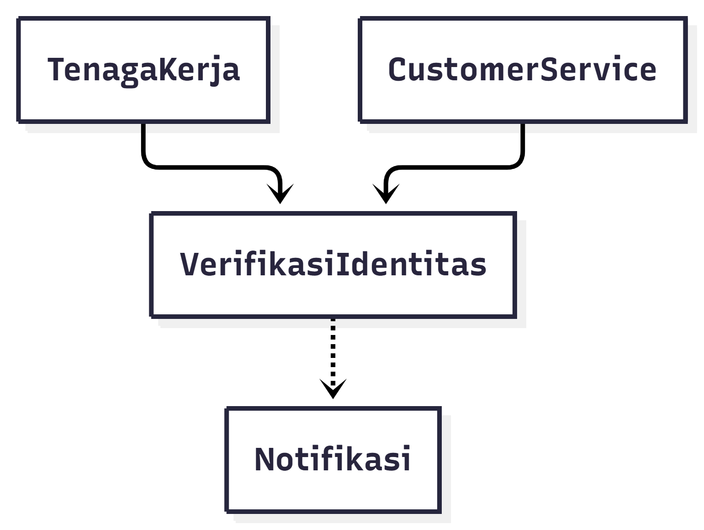

<i>Gambar 3. Diagram Kelas Use Case UC02</i>

 

| ID Kelas | Nama Kelas | Atribut | Metode/Operasi |
| :--- | :--- | :--- | :--- |
| C02 | TenagaKerja | status_verifikasi | ajukanVerifikasi(), perbaruiStatusVerifikasi() |
| C04 | CustomerService | - | tinjauVerifikasi(), setujuiVerifikasi(), tolakVerifikasi() |
| C05 | VerifikasiIdentitas | id_verifikasi, file_dokumen, waktu_pengajuan, status_persetujuan, alasan_penolakan | validasiFormatDokumen(), validasiUkuranDokumen(), simpanPengajuan() |
| C16 | Notifikasi | id_notifikasi, pesan_notifikasi, waktu_kirim, status_baca | kirimNotifikasi() |

---

### 4.2.3 Use Case UC03

**Nama Use Case:** *Mengelola Lowongan Pekerjaan*

#### Identifikasi Kelas

| ID Kelas | Nama Kelas | Deskripsi Kelas |
| :--- | :--- | :--- |
| C03 | PenyediaKerja | Turunan dari kelas `Pengguna`. Menyimpan data spesifik pencari jasa yang memiliki kemampuan untuk membuat lowongan dan melakukan pembayaran. |
| C06 | LowonganPekerjaan | Menyimpan rincian spesifikasi pekerjaan yang dibuat Penyedia Kerja, meliputi judul, deskripsi, lokasi (jika diperlukan), batas kuota, nominal upah, dan status ketersediaan (*Open*, *Closed/Full*). |

#### Diagram Kelas

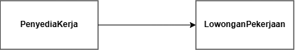

<i>Gambar 4. Diagram Kelas Use Case UC03</i>

 

| ID Kelas | Nama Kelas | Atribut | Metode/Operasi |
| :--- | :--- | :--- | :--- |
| C03 | PenyediaKerja | idPengguna, nama, email | buatLowonganBaru(judul, deskripsi, kuota, lokasi, upah), batalkanLowongan() |
| C06 | LowonganPekerjaan | idLowongan, judul, deskripsi, kuota, lokasi, upah, status | validasiIsianFormulir(), simpanLowongan(), setStatusDefault() |

---

### 4.2.4 Use Case UC04

**Nama Use Case:** *Mencari Lowongan Pekerjaan*

#### Identifikasi Kelas

| ID Kelas | Nama Kelas | Deskripsi Kelas |
| :--- | :--- | :--- |
| C02 | TenagaKerja | Turunan dari kelas `Pengguna`. Menyimpan data spesifik pekerja seperti status verifikasi, saldo pendapatan, dan portofolio pekerjaan. |
| C06 | LowonganPekerjaan | Menyimpan rincian spesifikasi pekerjaan yang dibuat Penyedia Kerja, meliputi judul, deskripsi, lokasi (jika diperlukan), batas kuota, nominal upah, dan status ketersediaan (*Open*, *Closed/Full*). |

#### Diagram Kelas

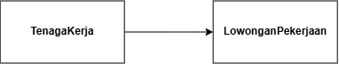

<i>Gambar 5. Diagram Kelas Use Case UC04</i>

 

| ID Kelas | Nama Kelas | Atribut | Metode/Operasi |
| :--- | :--- | :--- | :--- |
| C02 | TenagaKerja | idPengguna, nama | cariLowongan(kataKunci), filterLowongan(kategori) |
| C06 | LowonganPekerjaan | idLowongan, judul, kategori, lokasi, upah, status | tampilkanDaftarLowongan(filter), cekStatusOpen() |

---

### 4.2.5 Use Case UC05

**Nama Use Case:** *Mengajukan Penawaran Pekerjaan*

#### Identifikasi Kelas

| ID Kelas | Nama Kelas | Deskripsi Kelas |
| :--- | :--- | :--- |
| C02 | TenagaKerja | Turunan dari kelas `Pengguna`. Menyimpan data spesifik pekerja seperti status verifikasi, saldo pendapatan, dan portofolio pekerjaan. |
| C06 | LowonganPekerjaan | Menyimpan rincian spesifikasi pekerjaan yang dibuat Penyedia Kerja, meliputi judul, deskripsi, lokasi (jika diperlukan), batas kuota, nominal upah, dan status ketersediaan (*Open*, *Closed/Full*). |
| C07 | PengajuanPenawaran | Menyimpan data lamaran dari Tenaga Kerja untuk suatu lowongan. Berisi pesan penawaran, *timestamp*, dan status lamaran (*Pending*, *Accepted*, *Rejected*). |
| C16 | Notifikasi | Menyimpan dan mengelola pengiriman pesan pemberitahuan ke *dashboard* pengguna (misalnya notifikasi penerimaan pelamar, pembayaran berhasil, revisi, atau penerimaan upah). |

#### Diagram Kelas

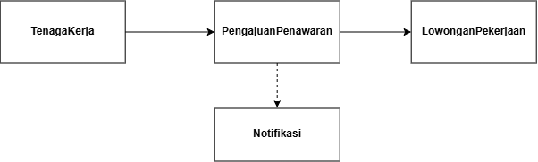

<i>Gambar 6. Diagram Kelas Use Case UC05</i>

 

| ID Kelas | Nama Kelas | Atribut | Metode/Operasi |
| :--- | :--- | :--- | :--- |
| C02 | TenagaKerja | idPengguna, statusVerifikasi | ajukanPenawaran(idLowongan, pesan), batalkanPengajuan() |
| C06 | LowonganPekerjaan | idLowongan, judul, status | tampilkanTombolAjukan() |
| C07 | PengajuanPenawaran | idPenawaran, idLowongan, idTenagaKerja, pesanPenawaran, timestamp, status | simpanPengajuan(), validasiStatusAkun() |
| C16 | Notifikasi | idNotifikasi, idPenerima, pesan, statusBaca | kirimNotifikasiPengajuanBaru() |

### 4.2.6 Use Case UC06

**Nama Use Case:** *Memilih Tenaga Kerja*

#### Identifikasi Kelas

| ID Kelas | Nama Kelas | Deskripsi Kelas |
| :--- | :--- | :--- |
| C03 | PenyediaKerja | Pengguna yang meninjau daftar pelamar dan menyetujui kandidat. |
| C06 | LowonganPekerjaan | Mengelola data spesifikasi pekerjaan, batas kuota, dan pembaruan status lowongan (*Open* / *Closed/Full*). |
| C07 | PengajuanPenawaran | Menyimpan data penawaran pelamar dan status persetujuan (*Pending*, *Accepted*, *Rejected*). |
| C08 | TransaksiPekerjaan | Membuat entri transaksi pekerjaan unik saat kandidat disetujui. |
| C16 | Notifikasi | Mengirim notifikasi status penerimaan kepada Tenaga Kerja terpilih. |

#### Diagram Kelas

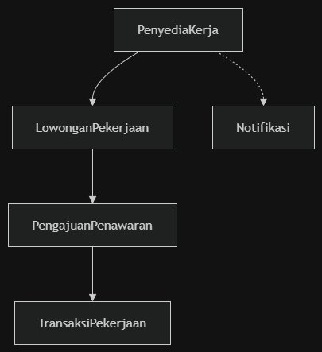

<i>Gambar 7. Diagram Kelas Use Case UC06</i>

 

| ID Kelas | Nama Kelas | Atribut | Metode/Operasi |
| :--- | :--- | :--- | :--- |
| C03 | PenyediaKerja | idPengguna, nama, email | lihatDaftarPelamar(), pilihPelamar(idPenawaran) |
| C06 | LowonganPekerjaan | idLowongan, judul, kuota, jumlahDiterima, status | cekKuotaSisa(), updateStatusLowongan(), kurangiKuota() |
| C07 | PengajuanPenawaran | idPenawaran, idLowongan, idTenagaKerja, pesan, status | setStatusPersetujuan(status) |
| C08 | TransaksiPekerjaan | idTransaksi, idLowongan, idTenagaKerja, idPenyediaKerja, statusPekerjaan | buatTransaksiBaru() |
| C16 | Notifikasi | idNotifikasi, idPenerima, pesan, statusBaca | kirimNotifikasiPenerimaan() |

---

### 4.2.7 Use Case UC07

**Nama Use Case:** *Melakukan Pembayaran Pekerjaan*

#### Identifikasi Kelas
| ID Kelas | Nama Kelas | Deskripsi Kelas |
| :--- | :--- | :--- |
| C03 | PenyediaKerja | Menginisiasi dan melakukan proses pembayaran upah pekerjaan. |
| C08 | TransaksiPekerjaan | Memperbarui status pekerjaan dari *Assigned* menjadi *In Progress* setelah pembayaran terverifikasi. |
| C10 | TagihanPembayaran | Mengelola *invoice*, total tagihan (upah + *commission fee*), dan batas waktu pembayaran. |
| C12 | PaymentGateway | Mengirimkan instruksi pembayaran ke API eksternal dan menerima callback konfirmasi. |
| C16 | Notifikasi | Mengirimkan notifikasi ke Tenaga Kerja bahwa pekerjaan siap dimulai. |

#### Diagram Kelas

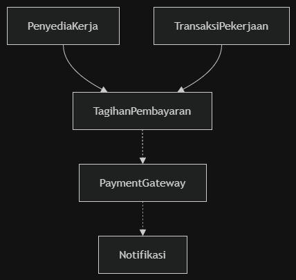

<i>Gambar 8. Diagram Kelas Use Case UC07</i>

 

| ID Kelas | Nama Kelas | Atribut | Metode/Operasi |
| :--- | :--- | :--- | :--- |
| C03 | PenyediaKerja | idPengguna, nama, email | bayarTagihan(idTagihan, metode) |
| C08 | TransaksiPekerjaan | idTransaksi, statusPekerjaan | updateStatusPekerjaan(status) |
| C10 | TagihanPembayaran | idTagihan, idTransaksi, nominalUpah, commissionFee, totalBayar, expiryTimestamp, statusBayar | hitungTotalTagihan(), buatInvoice(), updateStatusPembayaran() |
| C12 | PaymentGateway | idGateway, namaProvider, statusKoneksi | prosesPembayaran(), dapatkanCallbackStatus() |
| C16 | Notifikasi | idNotifikasi, idPenerima, pesan, statusBaca | kirimNotifikasiSiapKerja() |

---

### 4.2.8 Use Case UC08

**Nama Use Case:** *Menyerahkan Hasil Pekerjaan*

#### Identifikasi Kelas
| ID Kelas | Nama Kelas | Deskripsi Kelas |
| :--- | :--- | :--- |
| C02 | TenagaKerja | Mengunggah deskripsi dan berkas lampiran bukti penyelesaian pekerjaan. |
| C08 | TransaksiPekerjaan | Memperbarui status pengerjaan dari *In Progress* menjadi *Submitted*. |
| C09 | BuktiPenyerahan | Menyimpan file lampiran, catatan pengerjaan, dan stempel waktu pengiriman (*timestamp*). |
| C16 | Notifikasi | Mengirimkan notifikasi peninjauan hasil kerja kepada Penyedia Kerja. |

#### Diagram Kelas

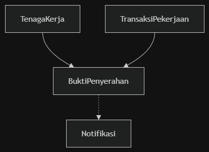

<i>Gambar 9. Diagram Kelas Use Case UC08</i>

 

| ID Kelas | Nama Kelas | Atribut | Metode/Operasi |
| :--- | :--- | :--- | :--- |
| C02 | TenagaKerja | idPengguna, nama, email | serahkanPekerjaan(idTransaksi, deskripsi, berkas) |
| C08 | TransaksiPekerjaan | idTransaksi, statusPekerjaan | updateStatusPekerjaan(status) |
| C09 | BuktiPenyerahan | idPenyerahan, idTransaksi, deskripsiPengerjaan, fileUrl, ukuranFile, timestampPengiriman | validasiUkuranFile(), simpanBukti() |
| C16 | Notifikasi | idNotifikasi, idPenerima, pesan, statusBaca | kirimNotifikasiPeninjauan() |

### 4.2.9 Use Case UC09

**Nama Use Case:** *Memverifikasi Penyelesaian Pekerjaan*

#### Identifikasi Kelas

| ID Kelas | Nama Kelas | Deskripsi Kelas |
| :--- | :--- | :--- |
| C02 | TenagaKerja | Turunan dari kelas `Pengguna`. Menyimpan data spesifik pekerja seperti status verifikasi, saldo pendapatan, dan portofolio pekerjaan. |
| C03 | PenyediaKerja | Turunan dari kelas `Pengguna`. Menyimpan data spesifik pencari jasa yang memiliki kemampuan untuk membuat lowongan dan melakukan pembayaran. |
| C08 | TransaksiPekerjaan | Menyimpan ID transaksi unik dan melacak siklus hidup pengerjaan dengan status seperti *Assigned*, *In Progress*, *Submitted*, *Completed*, atau *Disputed*. Kelas ini digunakan, ketika pelamar telah disetujui. |
| C16 | Notifikasi | Menyimpan dan mengelola pengiriman pesan pemberitahuan ke *dashboard* pengguna (misalnya notifikasi penerimaan pelamar, pembayaran berhasil, revisi, atau penerimaan upah). |

#### Diagram Kelas

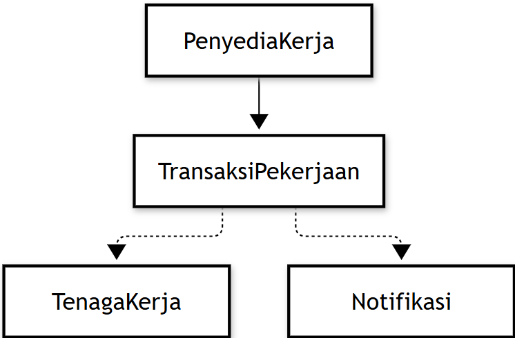

<i>Gambar 10. Diagram Kelas Use Case UC09</i>

 

| ID Kelas | Nama Kelas | Atribut | Metode/Operasi |
| :--- | :--- | :--- | :--- |
| C02 | TenagaKerja | idTenagaKerja, saldoPendapatan | terimaUpah(nominal) |
| C03 | PenyediaKerja | idPenyedia, nama | setujuiHasilPekerjaan() |
| C08 | TransaksiPekerjaan | idTransaksi, statusPekerjaan, nominalUpah | verifikasiSelesai(), picuPembayaranUpah() |
| C16 | Notifikasi | idNotifikasi, pesan, waktu | kirimNotifPenerimaanUpah(idTenagaKerja) |

### 4.2.10 Use Case UC10

**Nama Use Case:** *Melakukan Pencairan Dana*

#### Identifikasi Kelas

| ID Kelas | Nama Kelas | Deskripsi Kelas |
| :--- | :--- | :--- |
| C02 | TenagaKerja | Turunan dari kelas `Pengguna`. Menyimpan data spesifik pekerja seperti status verifikasi, saldo pendapatan, dan portofolio pekerjaan. |
| C11 | PencairanDana | Menyimpan data permintaan penarikan saldo oleh Tenaga Kerja, mencakup nominal, data bank/e-wallet tujuan, *timestamp*, dan status transfer. |
| C12 | PaymentGateway | Bertanggung jawab meneruskan instruksi pembayaran dan pencairan dana ke sistem eksternal, serta menerima status transaksi (berhasil, gagal, atau *expired*). |
| C16 | Notifikasi | Menyimpan dan mengelola pengiriman pesan pemberitahuan ke *dashboard* pengguna (misalnya notifikasi penerimaan pelamar, pembayaran berhasil, revisi, atau penerimaan upah). |

#### Diagram Kelas

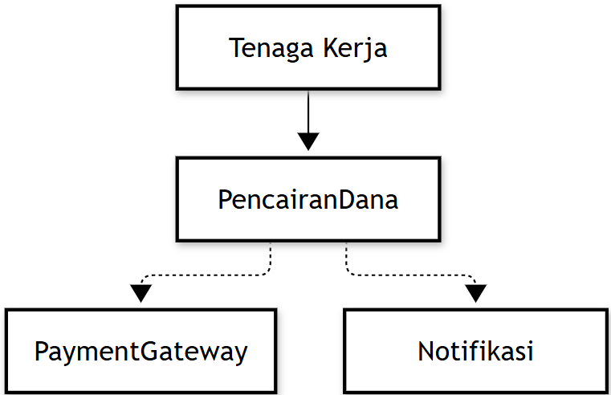

<i>Gambar 11. Diagram Kelas Use Case UC10</i>

 

| ID Kelas | Nama Kelas | Atribut | Metode/Operasi |
| :--- | :--- | :--- | :--- |
| C02 | TenagaKerja | idPengguna, nama, saldoPendapatan, rekeningTujuan | ajukanPencairan(nominal) |
| C11 | PencairanDana | idPencairan, idTenagaKerja, nominal, statusPencairan, waktuPengajuan | buatTransaksiPencairan(), updateStatusPencairan(status) |
| C12 | PaymentGateway | idGateway, namaProvider, statusKoneksi | prosesTransferDana(rekening, nominal), dapatkanCallbackStatus() |
| C16 | Notifikasi | idNotifikasi, idPenerima, pesan, statusBaca | kirimNotifPencairan(status) |

### 4.2.11 Use Case UC11

**Nama Use Case:** *Memberikan Penilaian Kerja*

#### Identifikasi Kelas

| ID Kelas | Nama Kelas | Deskripsi Kelas |
| :--- | :--- | :--- |
| C01 | Pengguna | Kelas abstrak yang menyimpan data dasar akun seperti nama, email, *password* terenkripsi, tanggal lahir (untuk validasi usia), dan token autentikasi. |
| C08 | TransaksiPekerjaan | Menyimpan ID transaksi unik dan melacak siklus hidup pengerjaan dengan status seperti *Assigned*, *In Progress*, *Submitted*, *Completed*, atau *Disputed*. Kelas ini digunakan, ketika pelamar telah disetujui. |
| C13 | UlasanRating | Menyimpan data penilaian pasca-pekerjaan, meliputi nilai (skala 1-5), deskripsi ulasan teks, dan ID transaksi terkait untuk memastikan tidak ada pengiriman ulasan ganda. |

#### Diagram Kelas

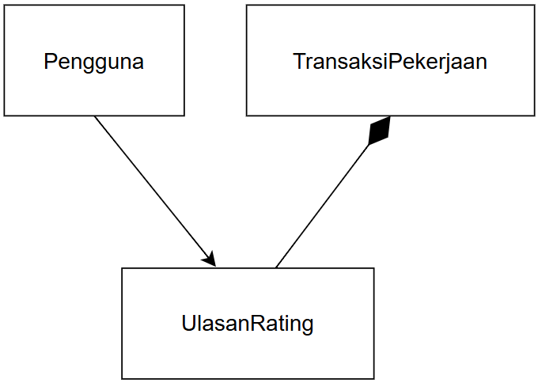

<i>Gambar 12. Diagram Kelas Use Case UC11</i>

 

| ID Kelas | Nama Kelas | Atribut | Metode/Operasi |
| :--- | :--- | :--- | :--- |
| C01 | Pengguna | idPengguna, nama, akumulasiRating | berikanUlasan(idTransaksi, nilai, deskripsi) |
| C08 | TransaksiPekerjaan | idTransaksi, statusPengerjaan | cekStatusSelesai(), validasiUlasanGanda() |
| C13 | UlasanRating | idUlasan, idTransaksi, nilai, deskripsiUlasan | simpanUlasan() |

### 4.2.12 Use Case UC12

**Nama Use Case:** *Menangani Keluhan*

#### Identifikasi Kelas

| ID Kelas | Nama Kelas | Deskripsi Kelas |
| :--- | :--- | :--- |
| C04 | CustomerService | Turunan dari kelas `Pengguna`. Menyimpan hak akses operasional internal platform untuk menangani verifikasi manual dan permasalahan sengketa. |
| C08 | TransaksiPekerjaan | Menyimpan ID transaksi unik dan melacak siklus hidup pengerjaan dengan status seperti *Assigned*, *In Progress*, *Submitted*, *Completed*, atau *Disputed*. Kelas ini digunakan, ketika pelamar telah disetujui. |
| C14 | TiketSengketa | Menyimpan data laporan keluhan, meliputi kategori masalah, deskripsi komplain, file bukti pendukung awal, dan status tiket sengketa (*Open*, *Need More Proof*, *Resolved*, *Rejected*). |
| C15 | RiwayatSengketa | Menyimpan log atau rekam jejak aktivitas secara kronologis pada suatu tiket sengketa, seperti penambahan bukti susulan dan eksekusi keputusan (*refund*/pencairan) oleh Customer Service. |
| C16 | Notifikasi | Menyimpan dan mengelola pengiriman pesan pemberitahuan ke *dashboard* pengguna (misalnya notifikasi penerimaan pelamar, pembayaran berhasil, revisi, atau penerimaan upah). |

#### Diagram Kelas

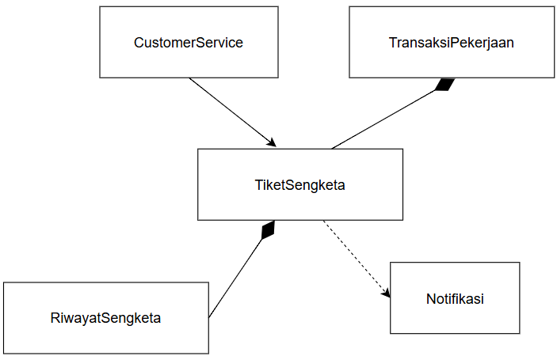

<i>Gambar 13. Diagram Kelas Use Case UC12</i>

 

| ID Kelas | Nama Kelas | Atribut | Metode/Operasi |
| :--- | :--- | :--- | :--- |
| C04 | CustomerService | idPengguna, nama, peran | tinjauTiket(idTiket), putuskanSengketa(idTiket, keputusan) |
| C08 | TransaksiPekerjaan | idTransaksi, statusPengerjaan | getDetailTransaksi() |
| C14 | TiketSengketa | idTiket, idTransaksi, idPelapor, kategoriMasalah, deskripsiKomplain, statusTiket | buatTiket(), updateStatus(statusBaru) |
| C15 | RiwayatSengketa | idRiwayat, idTiket, logAktivitas, timestamp | catatRiwayat(aktivitas) |
| C16 | Notifikasi | idNotifikasi, idPengguna, pesan, statusBaca | kirimNotifikasi(pesan) |

## 4.3 Diagram Kelas Keseluruhan

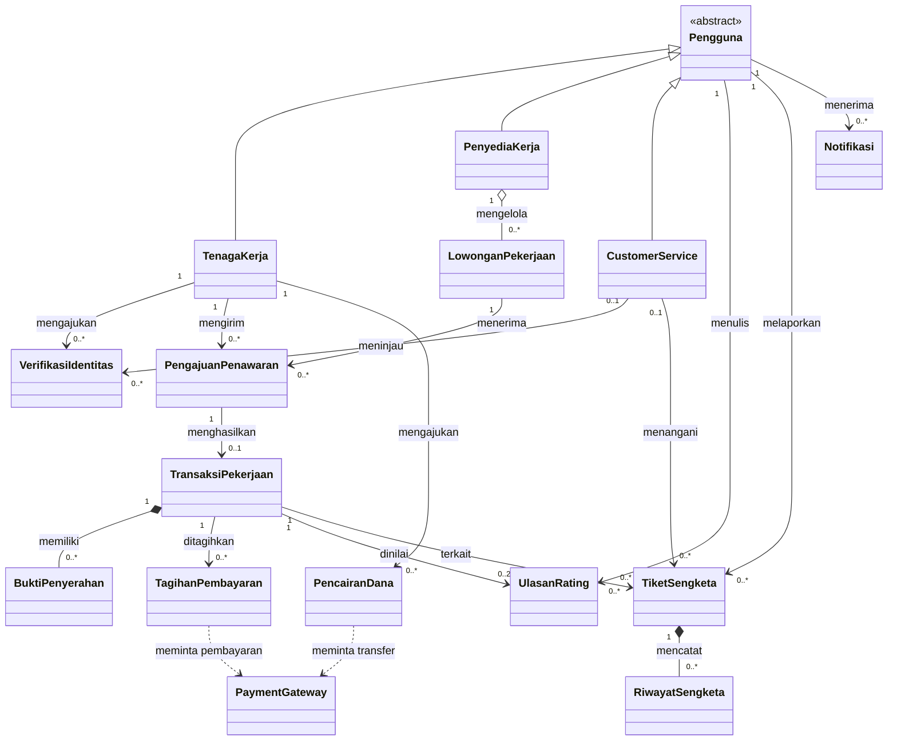

| ID Kelas | Nama Kelas | Atribut | Metode/Operasi |
| :--- | :--- | :--- | :--- |
| *C01* | *Pelanggan* | *idPelanggan, nama, email* | *lihatRiwayatPesanan()* |
| *C02* | *Pesanan* | *idPesanan, total, status* | *hitungTotal(), perbaruiStatus()* |
| *C03* | *Keranjang* | *daftarItem* | *tambahItem(), checkout()* |
| *C04* | *MetodePembayaran* | *-* | *kirimKePaymentGatewayDummy()* |
| *C05* | *Kartu* | *nomorKartu, masaBerlaku* | *kirimKePaymentGatewayDummy()* |
| *C06* | *EWallet* | *saldo, idAkun* | *cekSaldo(), kirimKePaymentGatewayDummy()* |
| *C07* | *RiwayatTransaksi* | *idTransaksi, waktu, status* | *catatTransaksi(), tampilkanNotifikasi()* |
| *...* | *...* | *...* | *...* |

---

# BAB 5: Traceability
Berikut merupakan keterkaitan antara class yang telah ditetapkan dengan use case dan kebutuhan fungsional.

| ID Kelas | ID Use Case | ID KF |
| :--- | :--- | :--- |
| C01 | UC01, UC11 | KF01, KF02, KF03, KF21, KF22, KF23 |
| C02 | UC01, UC02, UC04, UC05, UC08, UC09, UC10, UC11 | KF01, KF02, KF04, KF05, KF06, KF09, KF10, KF11, KF16, KF18, KF19, KF20, KF21, KF22, KF23 |
| C03 | UC01, UC03, UC06, UC07, UC09, UC11 | KF01, KF07, KF08, KF12, KF14, KF15, KF17, KF21, KF22, KF23 |
| C04 | UC02, UC12 | KF05, KF24, KF25, KF26 |
| C05 | UC02 | KF04, KF05, KF06 |
| C06 | UC03, UC04, UC05, UC06 | KF07, KF08, KF09, KF10, KF12, KF13 |
| C07 | UC05, UC06 | KF10, KF11, KF12 |
| C08 | UC06, UC07, UC08, UC09, UC11, UC12 | KF12, KF14, KF16, KF17, KF21, KF22, KF24, KF25 |
| C09 | UC08, UC09 | KF16, KF17 |
| C10 | UC07 | KF14, KF15 |
| C11 | UC10 | KF19, KF20 |
| C12 | UC07, UC10, UC12 | KF14, KF15, KF19, KF20, KF25 |
| C13 | UC11 | KF21, KF22, KF23 |
| C14 | UC12 | KF24, KF25, KF26 |
| C15 | UC12 | KF25, KF26 |
| C16 | UC02, UC05, UC07, UC08, UC09, UC10, UC12 | KF05, KF11, KF14, KF16, KF18, KF20, KF25, KF26 |

---

# Referensi

- Diagram UML: [https://www.drawio.com/](https://www.drawio.com/), [https://staruml.io/](https://staruml.io/)
