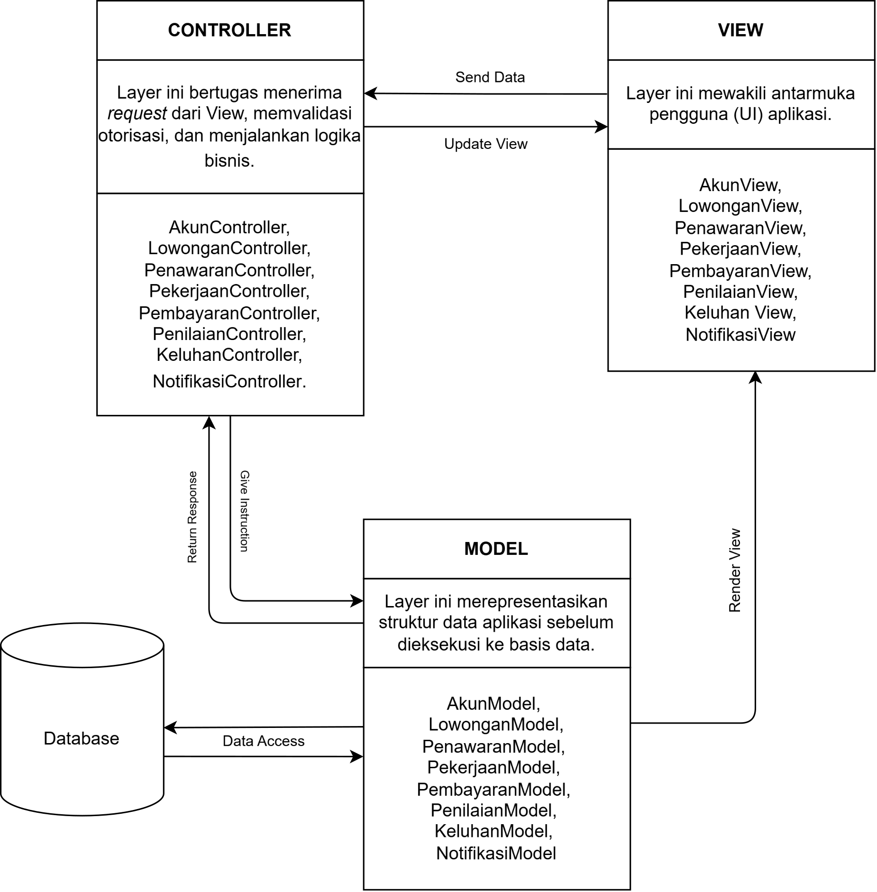

<h1>
IF2150 REKAYASA PERANGKAT LUNAK
 
TUGAS 6
 
ARSITEKTUR PERANGKAT LUNAK (APL)
</h1>
 

## Kerja-In

### Untuk: Agatha Tatianingseto

Dipersiapkan oleh:

| Informasi | Keterangan |
| --- | --- |
| Kelas | 03 |
| Kelompok | Shifu  |

| NIM | Nama |
| --- | --- |
| 13525033 | Davin Farel Santoso |
| 13525039 | Aditya Rasyid|
| 13525096 | Muhammad Ridwan Nasir Firdaus |
| 13525102 | Karmel Tua Haloho |
| 13525123 | Sebastio Nugroho |
---

 
 

# BAB 1: Style/Pattern Arsitektur Acuan

<i>Gambar 1.  Arsitektur MVC</i>

Tabel 1.1. Lingkungan Operasi Perangkat Lunak

| Komponen | Spesifikasi |
| --- | --- |
| Server | Node.js dengan framework Hono, dijalankan pada layanan Railway. |
| Client | Web browser modern yang mendukung JavaScript, seperti Google Chrome, Mozilla Firefox, Microsoft Edge, dan Safari versi terbaru. |
| DBMS | PostgreSQL yang disediakan melalui layanan Supabase. |
| Authentication | Supabase Auth sebagai layanan autentikasi dan pengelolaan sesi pengguna. |
| File Storage | Supabase Storage |
| OS | Cross-platform melalui web browser pada Windows, Linux, macOS, Android, dan iOS. |

Pemilihan arsitektur Model-View-Controller (MVC) sebagai acuan untuk perangkat lunak Kerja-In didasarkan pada kesesuaiannya yang kuat dengan karakteristik pengguna, alur proses bisnis, serta lingkungan teknologi sistem. Sebagai aplikasi marketplace jasa, Kerja-In melayani tiga jenis pengguna dengan kebutuhan antarmuka yang berbeda yakni Tenaga Kerja, Penyedia Kerja, dan Customer Service (CS). Pola MVC memungkinkan sistem untuk menyajikan antarmuka (View) dan logika pemrosesan (Controller) yang spesifik untuk masing-masing peran, tetapi tetap terintegrasi secara terpusat pada pengelolaan entitas data (Model) yang sama. Hal ini efektif mencegah duplikasi data dan memastikan konsistensi informasi lintas pengguna.

Selain itu, alur proses bisnis pada aplikasi ini sangat interaktif dan sepenuhnya digerakkan oleh aksi pengguna, seperti pengajuan pekerjaan, konfirmasi penyelesaian, penanganan sengketa, hingga proses pembayaran. Arsitektur MVC dirancang secara natural untuk menangani siklus permintaan dan repons yang dinamis ini, View menangkap interaksi pengguna, Controller bertindak sebagai penengah untuk memvalidasi dan memproses logika bisnis, dan Model memperbarui status pada basis data secara aman.

Dari segi pengembangan, MVC menerapkan pemisahan tanggung jawab yang tegas antara tampilan antarmuka, logika bisnis, dan aturan data. Pemisahan ini sangat menguntungkan tim pengembang karena memungkinkan pengerjaan frontend dan backend dilakukan secara paralel dan modular tanpa saling mengganggu. Terakhir, MVC merupakan fondasi bawaan dari mayoritas framework web modern yang menjadi lingkungan operasi perangkat lunak ini. Dengan menerapkan MVC, pengembangan sistem tidak hanya mematuhi standard industri, tetapi juga menjamin skalabilitas dan kemudahan pemeliharaan perangkat lunak di masa depan.

---

# BAB 2: Identifikasi Komponen / Modul / Subsistem

Komponen Kerja-In dikelompokkan berdasarkan pola MVC menjadi Model, View, dan Controller. Kelas yang memiliki fungsi berkaitan ditempatkan dalam satu komponen dengan nama kelas utama yang mewakilinya. Komponen autentikasi, basis data, dan penyimpanan berkas mendukung pengoperasian aplikasi.

Tabel 2.1. Identifikasi Komponen/Modul/Subsistem

| Nama Komponen/Modul/Subsistem | Jenis | Penjelasan |
| :--- | :--- | :--- |
| Pengguna | Model | Mengelola identitas akun, profil sesuai peran, portofolio, saldo, dan status verifikasi pengguna. Mencakup kelas Pengguna, TenagaKerja, PenyediaKerja dan CustomerService. |
| LowonganPekerjaan | Model | Model yang menyimpan spesifikasi pekerjaan meliputi judul, deskripsi, batas kuota, nominal upah, dan status (*Open/Closed*). |
| PengajuanPenawaran | Model | Model yang menyimpan data lamaran dari Tenaga Kerja, berisi pesan penawaran, *timestamp*, dan status lamaran. |
| TransaksiPekerjaan | Model | Mengelola kesepakatan, status pengerjaan, deskripsi hasil, lampiran bukti, dan waktu penyerahan. Mencakup kelas TransaksiPekerjaan dan BuktiPenyerahan. |
| TagihanPembayaran | Model | Mengelola tagihan, upah dan biaya layanan, permintaan penarikan pendapatan, tujuan transfer, serta catatan dan status transaksi pembayaran. Mencakup kelas TagihanPembayaran, PencairanDana dan PaymentGateway. |
| UlasanRating | Model | Model yang menyimpan data penilaian pasca-pekerjaan (skala 1-5) dan ulasan teks untuk mencegah *double review*. |
| TiketSengketa | Model | Mengelola laporan keluhan, bukti, status tiket, keputusan, dan riwayat penanganan. Mencakup kelas TiketSengketa dan RiwayatSengketa. |
| Notifikasi | Model | Model yang menyimpan pesan pemberitahuan ke *dashboard* pengguna terkait aktivitas akun maupun transaksi. |
| PenggunaUI | View | Menampilkan formulir registrasi/login, profil, dashboard pengguna, dan pengajuan serta pemeriksaan identitas. Mencakup kelas PenggunaUI, TenagaKerjaUI, PenyediaKerjaUI dan CustomerServiceUI. |
| LowonganPekerjaanUI | View | Antarmuka yang menyediakan formulir pembuatan lowongan dan katalog pencarian pekerjaan. Meneruskan aksi pengguna yang terkait ke LowonganPekerjaanController. |
| PengajuanPenawaranUI | View | Antarmuka yang menampilkan formulir pengisian pesan penawaran bagi Tenaga Kerja. Meneruskan aksi pengguna yang terkait ke PengajuanPenawaranController. |
| TransaksiPekerjaanUI | View | Menampilkan rincian dan status pekerjaan, formulir unggah hasil, serta pilihan persetujuan atau revisi. Mencakup kelas TransaksiPekerjaanUI dan BuktiPenyerahanUI. |
| TagihanPembayaranUI | View | Menampilkan invoice, metode dan instruksi pembayaran, formulir penarikan pendapatan, serta status transaksi dana. Mencakup kelas TagihanPembayaranUI, PencairanDanaUI dan PaymentGatewayUI. |
| UlasanRatingUI | View | Antarmuka yang merender formulir pemberian bintang dan komentar ulasan. Meneruskan aksi pengguna yang terkait ke UlasanRatingController. |
| TiketSengketaUI | View | Menampilkan formulir dan rincian keluhan, bukti tambahan, keputusan, serta urutan aktivitas penanganan. Mencakup kelas TiketSengketaUI dan RiwayatSengketaUI. |
| NotifikasiUI | View | Antarmuka berupa *pop-up*, bel, atau menu *dropdown* pesan masuk bagi pengguna. Meneruskan aksi pengguna yang terkait ke NotifikasiController. |
| PenggunaController | Controller | Memproses registrasi/login, pembaruan profil, pemeriksaan hak akses, dan keputusan verifikasi identitas. Mencakup kelas PenggunaController, TenagaKerjaController, PenyediaKerjaController dan CustomerServiceController. |
| LowonganPekerjaanController | Controller | Pengendali untuk memvalidasi isian *create* lowongan, pemfilteran pencarian, dan kalkulasi sisa kuota. |
| PengajuanPenawaranController | Controller | Pengendali untuk memvalidasi persyaratan melamar dan merekam data pelamar ke *database*. |
| TransaksiPekerjaanController | Controller | Memproses perubahan status pekerjaan, validasi dan penyimpanan bukti, serta konfirmasi penyelesaian atau permintaan revisi. Mencakup kelas TransaksiPekerjaanController dan BuktiPenyerahanController. |
| TagihanPembayaranController | Controller | Menghitung tagihan, memvalidasi saldo serta tujuan transfer, mengirim instruksi pembayaran, pencairan atau refund, dan memproses konfirmasi layanan pembayaran eksternal. Mencakup kelas TagihanPembayaranController, PencairanDanaController dan PaymentGatewayController. |
| UlasanRatingController | Controller | Pengendali untuk mencegah ulasan ganda dan merekapitulasi rata-rata rating. |
| TiketSengketaController | Controller | Memvalidasi laporan serta kewenangan petugas, mencatat keputusan dan riwayat, serta memproses tindak lanjut penyelesaian sengketa. Mencakup kelas TiketSengketaController dan RiwayatSengketaController. |
| NotifikasiController | Controller | Pengendali untuk memicu pengiriman pesan otomatis secara *real-time* ke penerima yang tepat. |
| Autentikasi | Pendukung | Memverifikasi kredensial dan mengelola sesi pengguna agar akses aplikasi sesuai dengan identitas serta hak pengguna. |
| Database | Penyimpanan Data | Menyimpan data aplikasi secara persisten, termasuk akun, lowongan, penawaran, pekerjaan, pembayaran, penilaian, keluhan, dan riwayat aktivitas. |
| PenyimpananBerkas | Penyimpanan Data | Menyimpan dokumen identitas, lampiran hasil pekerjaan, dan bukti keluhan serta menyediakan akses berkas sesuai hak pengguna. |

---

# BAB 3: Model Arsitektur Perangkat Lunak

## 3.1 Logical View

Pada Kerja-In, pola MVC membagi aplikasi menjadi tiga bagian. *View* menampilkan halaman yang digunakan pengguna, *Controller* memproses aksi dan aturan aplikasi, sedangkan *Model* mengelola data. Pembagian ini terlihat pada diagram berikut.

  

  <i>Gambar 2. Class Diagram Logical View Kerja-In</i>

Di dalam diagram, aksi dari halaman pengguna diteruskan ke *Controller*, lalu *Controller* membaca atau memperbarui data pada *Model*. Data disimpan di Database. Autentikasi digunakan untuk memeriksa kredensial dan sesi pengguna, sementara PenyimpananBerkas digunakan untuk menyimpan dokumen identitas dan bukti pekerjaan maupun sengketa.

Pembayaran melibatkan PaymentGatewayEksternal, yaitu layanan di luar Kerja-In yang menerima instruksi pembayaran dan mengirimkan status transaksi kembali ke aplikasi. Sementara itu, PaymentGateway pada bagian Model mencatat transaksi dan komunikasi dengan layanan tersebut. Diagram juga mencakup komponen untuk mengelola lowongan, lamaran, pekerjaan, ulasan, sengketa, dan notifikasi.

---

# Referensi

- Sommerville, I. (2016). *Software Engineering* (10th ed.). Pearson. Chapter 6: *Architectural Design*: [https://software-engineering-book.com/slides/](https://software-engineering-book.com/slides/)
- Diagram arsitektur: [https://www.drawio.com/](https://www.drawio.com/), [https://staruml.io/](https://staruml.io/)
